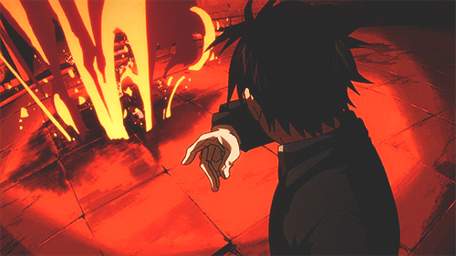
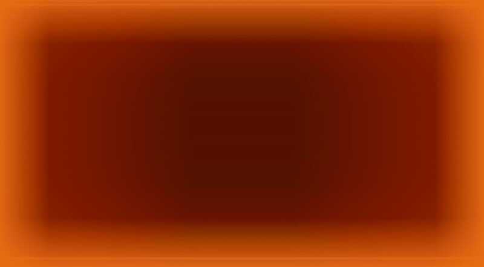

# mustang 🔥🫰

<p align="center">
  
</p>

Snap your fingers → your Mac presses a key and the screen edges burst into
flame. Named after a certain Flame Alchemist.

<p align="center">
  
</p>

Listens to the microphone, detects finger snaps with a two-stage DSP
pipeline (~26 ms latency), presses a configurable key system-wide, and
flashes a fiery full-screen overlay. Ships as a menu-bar app. **macOS only**,
written in Go (cgo: CoreAudio via [malgo], CGEvent + Cocoa).

[malgo]: https://github.com/gen2brain/malgo

## Build & install (macOS)

The primary build is a signed `.app` bundle, so macOS grants Microphone and
Accessibility to Mustang itself rather than to your terminal:

```sh
./build-app.sh                 # builds dist/Mustang.app
cp -R dist/Mustang.app /Applications/
open -a Mustang                # 🔥 appears in the menu bar
```

Prefer the terminal? You can also just build and run the binary directly —
same detector, prints triggers to stdout, `-v` for live tuning:

```sh
go build -o mustang .
./mustang -device macbook -v   # -list to see capture devices
```

Run this way, the permissions attach to your terminal instead of the app;
grant Microphone and Accessibility to it, or key presses are dropped.

On first launch macOS will ask for two permissions, both granted to the app
itself (not your terminal):

- **Microphone** — allow in the dialog.
- **Accessibility** — the standard prompt appears; enable Mustang in
  System Settings → Privacy & Security → Accessibility, then restart the
  app (Quit via the 🔥 menu-bar item). Without it, key presses are silently
  dropped and the keyboard-event filter is disabled.

Signing: `build-app.sh` signs with `$MUSTANG_SIGN_ID`, or the first
"Apple Development" certificate in your keychain, or falls back to ad-hoc.
With a real certificate the app's identity is stable and permissions
survive rebuilds; with ad-hoc you must re-grant Accessibility after every
rebuild (`tccutil reset Accessibility com.mustang.app` helps clear a
stale entry).

## How snap detection works

1. **Transient stage.** Input is band-passed to ~1.6–4.5 kHz — published
   measurements put finger-snap energy there, while a keyboard's bottom-out
   thud (<800 Hz) and bright switch click (>6 kHz) fall outside. A candidate
   must exceed an absolute peak threshold, stand well above a running noise
   floor (slow RMS EMA), be impulsive (high crest factor), and rise out of
   silence.
2. **Spectral stage.** ~25 ms around the transient is analyzed with Goertzel
   bins in three bands: low (300–800 Hz), mid (2–4.4 kHz), high (6–9 kHz).
   A snap must dominate in the mid band over both neighbors.
3. **Input-event filter.** Sound alone cannot fully separate a snap from a
   clicky mechanical keyboard (their spectra overlap around 2–4 kHz), so any
   *real* input event suppresses triggers: key down/up and modifiers for
   350 ms, mouse clicks for 150 ms, and 1.5 s while actively typing
   (≥3 key-downs in 2 s). The app's own synthetic presses are excluded.
   This makes keyboard false-positives structurally impossible while you
   type on the same machine.

End-to-end latency (snap sound → key press) is ~26 ms: 5 ms capture buffers
plus the 25 ms confirmation window. App Nap is disabled and the flash
overlay window is pre-created, so latency stays flat over time.

## Configuration

Flags work in CLI mode; the .app reads the same keys from
`~/.mustang.conf` (`name = value` lines, `#` comments):

```
device = macbook
key = 1
```

| Flag / key | Default | Meaning |
|---|---|---|
| `key` | `1` | digit key to press (0–9) |
| `device` | system default | capture device name substring (`-list` to enumerate) |
| `threshold` | `0.06` | absolute band-passed peak threshold (0..1) |
| `ratio` | `6` | peak must exceed noise floor by this factor |
| `crest` | `3` | min crest factor (impulsiveness) |
| `band` | `2.5` | min mid/low band energy ratio |
| `bright` | `1.5` | min mid/high band energy ratio |
| `debounce` | `200ms` | min interval between triggers (~5 snaps/s) |
| `gain` | `1` | software input gain |

Tuning: run the CLI with `-v` and snap/type — every candidate, rejection
(with the failed check) and trigger is printed with its measurements. The
app also mirrors trigger lines to `~/Library/Logs/mustang.log`, including
per-snap latency.

## Icon

To build the app icon from any square artwork (dark background around a
centered square is cropped automatically):

```sh
go run ./icon assets/icon.png    # → icon/icon-1024.png, Apple-grid masked
icon/make-icns.sh                # → icon/Mustang.icns
./build-app.sh                   # picks the .icns up automatically
```

## License

MIT for the code. The Roy Mustang artwork in `assets/` is Fullmetal
Alchemist fan art, included for fun and not covered by the MIT license.
